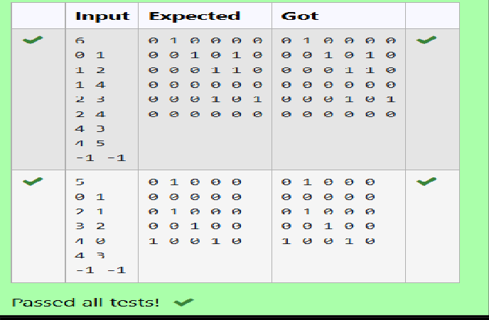

# Ex5(A) Representation of Graph
## DATE:21-04-2025
## AIM:
To write a C program to display the adjacency matrix of the given graph by supplying the edges and the number of vertices.

## Algorithm
1. Start
2. Read the value of V (number of vertices).
3. Declare an adjacency matrix adjMatrix[V][V].
4. Initialize the matrix to 0 using the init function.
5. Calculate the maximum number of edges me as n * (n - 1) / 2.
6. For each edge, read e1 and e2, add the edge to the adjacency matrix, and stop if e1 == -1 
&& e2 == -1.
7. Print the adjacency matrix.
8. End

## Program:
```
/*
Program to display the adjacency matrix of the given graph
Developed by:MARELLA HASINI
RegisterNumber:212223240083
*/
/*#include<stdio.h> 
int V;
//init matrix to 0 
void init(int arr[][V])
{
int i,j;
for(i = 0; i < V; i++) 
for(j=0;j<V;j++)
arr[i][j] =0;
}
*/
int main()
{ int e1,e2,me,n,i;
scanf("%d",&V); 
int adjMatrix[V][V]; 
init(adjMatrix); 
n=V;
me=n*(n-1)/2; 
for(i=0;i<me;i++)
{
scanf("%d%d",&e1,&e2); 
addEdge(adjMatrix,e1,e2); 
if(e1==-1 &&e2==-1)
{
break;
}
}
printAdjMatrix(adjMatrix);
}

```

## Output:



## Result:
Thus, the C program to print the adjacency matrix of the given graph is implemented successfully.
