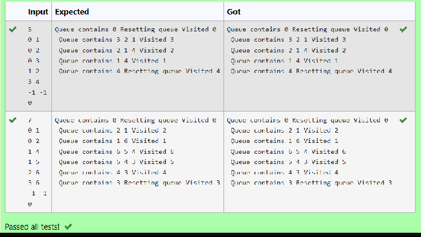

# Ex5(B) Breadth First Graph
## DATE:21-04-2025
## AIM:
To write a printQueue C function of the given graph that is to be traversed in the breadth first manner.


## Algorithm
1. Start
2. Start from the front index of the queue.
3. If the queue is empty, print "Queue is empty".
4. Otherwise, print "Queue contains" and display all items from front to rear.
5. Return after printing the queue contents.
6. End

## Program:
```
/*
Program to traverse graph using BFS
Developed by:MARELLA HASINI 
RegisterNumber:212223240083 
*/
/*#include<stdio.h> 
#include<stdlib.h> 
#define SIZE 40
struct queue{
int items[SIZE]; 
int front;
intrear;
};
struct queue* createQueue();
void enqueue(struct queue*q, int); 
int dequeue(struct queue*q);
voiddisplay(struct queue*q); 
int isEmpty(struct queue*q);
void printQueue(struct queue* q);
struct node{ 
int vertex;
struct node* next;
};
struct node*createNode(int); 
struct Graph {
int numVertices; 
struct node**adjLists; 
int* visited;
};*/
void printQueue(struct queue*q){ 
int i=q->front;
if(isEmpty(q))
{
printf("Queue is empty");
}
else
{
printf("Queue contains "); 
for(i=q->front;i<q->rear+1;i++)
{
printf("%d",q->items[i]);
}
}
}

```

## Output:



## Result:
Thus, the code for the printQueue function of the following graph that is to be traversed in the breadth first manner is implemented successfully.
