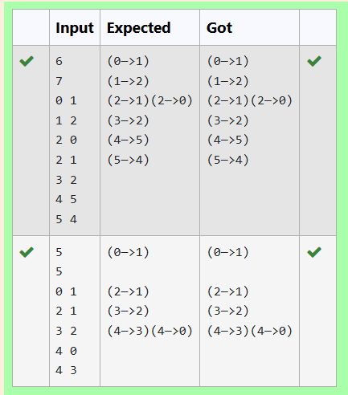

# Ex5(E) Adjacency List Representation
## DATE:28-04-2025
## AIM:
To write a C program to represent the given graph using the adjacency list.

## Algorithm
1. Read the number of vertices and number of edges.
2. Read all edge pairs (source and destination) and store them.
3. Create a graph using the input edge list.
4. Print the adjacency list representation of the graph.

## Program:
```
/*
Program to find and display the priority of the operator in the given Postfix expression
Developed by:MARELLA HASINI 
RegisterNumber:212223240083  
*/
int main(void)
{ int n,i;
 scanf("%d",&N);
 scanf("%d",&n);
 // input array containing edges of the graph (as per the above diagram)
 // (x, y) pair in the array represents an edge from x to y
 struct Edge edges[n];
 for (i = 0; i < n; i++)
 {
 // get the source and destination vertex
 scanf("%d",&edges[i].src);
 scanf("%d",&edges[i].dest);
 
 }
 
 // construct a graph from the given edges
 struct Graph *graph = createGraph(edges, n);
 // Function to print adjacency list representation of a graph
 printGraph(graph);
 return 0;
}

```

## Output:



## Result:
Thus, the C program to represent the given graph using the adjacency list is implemented successfully.

